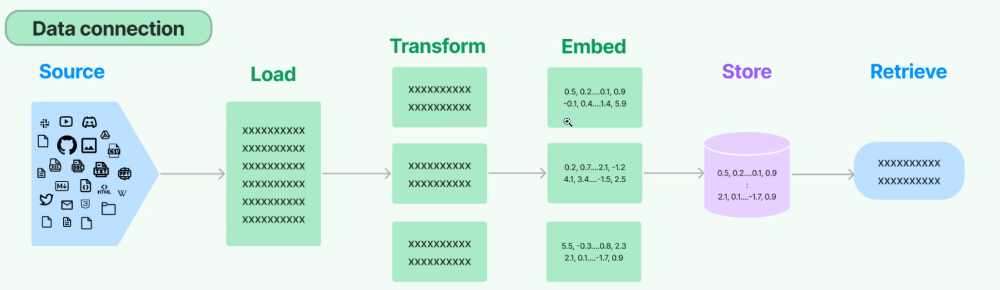
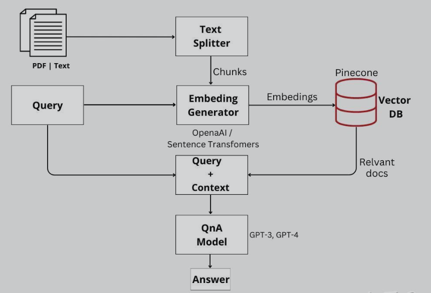
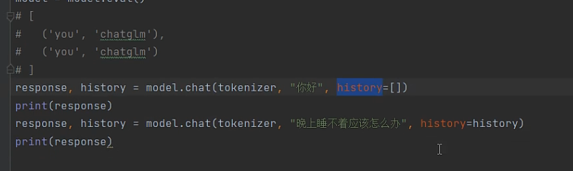

# 问题一

阿里云直接下载chatglm模型文件很慢，上传文件也很慢。

只能用modelscope来下载。


# 问题二

modelscope下载的文件和Github原文件东西不一致，尽管模型文件一样，但是其他内容不一样，所以要进行替换。


# 问题三

各种包的不匹配，版本问题严重，特别是阿里云上。

gradio=，marqo


# 发现

## 一



history是数组，但数组里的元素是元组。


## 二

主要使用Model scope来解决下载速度和访问限制的问题

下了chatglm的模型文件（问答），text2vec-base-chinese模型文件（embedding要用的），下载了pinecone（向量搜索），chromadb向量数据库

[从零开始用LangChain、Pinecone和LLMs搭建你自己的文档问答系统 - 知乎 (zhihu.com)](https://zhuanlan.zhihu.com/p/637846309)


# 创建向量数据库流程

首先使用langchain的directoryloader进行数据加载。

先拆分成chunks，然后进行embedding。

然后使用text2vec-base-chinese模型把文件转换为向量。

使用chroma进行向量存储。


# 用到的关键库函数

```python
from langchain.document_loaders import DirectoryLoader
from langchain.document_loaders import TextLoader
from langchain.text_splitter import CharacterTextSplitter
from langchain.embeddings.huggingface import HuggingFaceEmbeddings
from langchain.vectorstores import Chroma
from langchain.chains import RetrievalQA
```


# 创建webui

gradio库函数

chatinterface


# 思考

chunk size有点像Batch size

### Chunk Size

- **定义**：在 `langchain` 或类似文本处理库中，`chunk size` 指的是将长文本分割成更小部分时每个部分的字符数（或可能是词数）。例如，在处理长文本文档时，你可能会将其分割成每个包含512个字符的小段落或“块”。
- **目的**：这样做的主要目的是为了适应处理限制，比如输入长度限制。许多自然语言处理模型（如基于Transformers的模型）有最大输入长度的限制，`chunk size` 确保每个文本块都能被模型处理。
- **应用场景**：文本分割通常在预处理阶段使用，以便在后续的文本分析或处理（例如信息检索、文本摘要、问答系统等）中使用。

### Batch Size

- **定义**：在机器学习中，`batch size` 指的是在模型训练过程中一次性处理的数据样本数量。例如，如果你有1000个训练样本，`batch size` 是100，那么这些样本将被分成10个批次进行训练。
- **目的**：`batch size` 影响模型训练的内存需求、速度和优化动态。较小的 `batch size` 可以减少内存占用并提高训练过程的随机性，而较大的 `batch size` 可以加快训练速度。
- **应用场景**：`batch size` 主要用于模型的训练阶段，影响梯度下降和反向传播的方式。


chunk太小有些信息会被切断呗

overlap就是为了防止被切断，做一点重复项


### chain type方法

stuff，map_reduce，refine三种

retriever的方法用的stuff？还是refine

stuff对token消耗特别大，stuff直接把内容原来的样子直接喂给了模型，效率很低。

而且调优的时候，chunk切片的比例还有overlap


